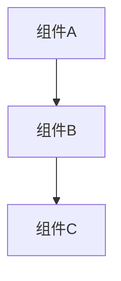
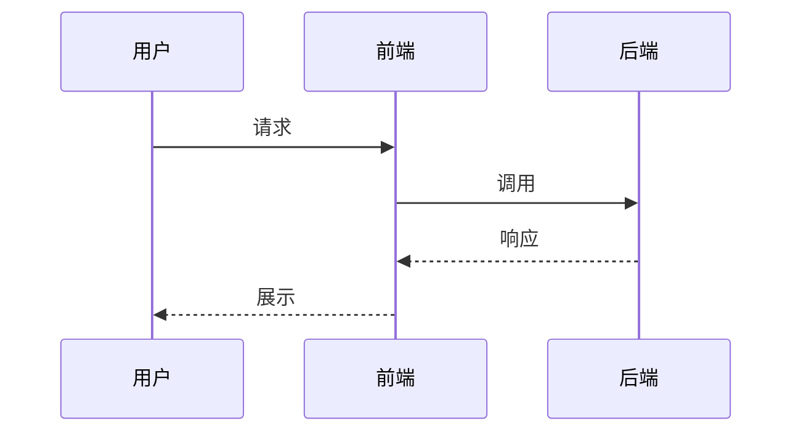
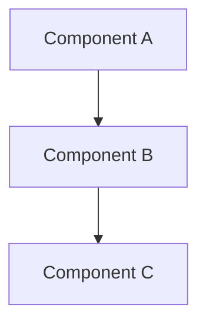
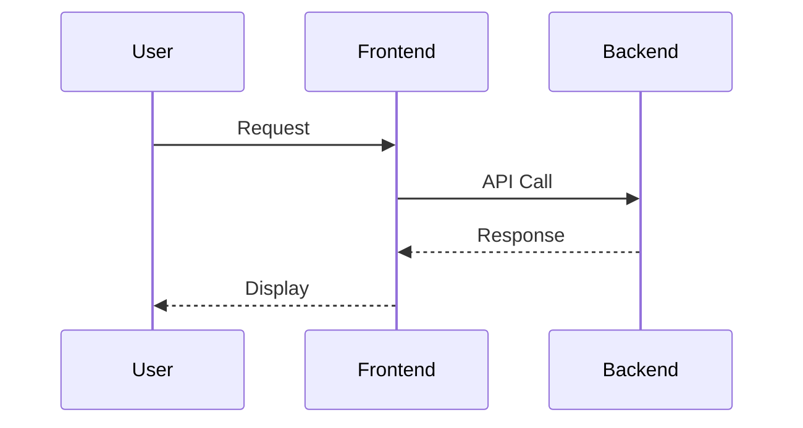

根据 git commit 历史生成报告。用户输入：$ARGUMENTS

## 执行流程

### 第一步：解析用户意图

从 `$ARGUMENTS` 中提取：

1. **报告类型**：
   - "日报" / "daily" → 日报
   - "周报" / "weekly" → 周报
   - "月报" / "monthly" → 月报
   - 未指定 → 默认周报

2. **日期范围**：
   - "本月" / "这个月" / "this month" → 当前月
   - "上月" / "上个月" / "last month" → 上一个月
   - "本周" / "这周" / "this week" → 当前周
   - "上周" / "last week" → 上一周
   - "X月" → 指定月份
   - "YYYY-MM-DD到YYYY-MM-DD" / "YYYY-MM-DD to YYYY-MM-DD" → 自定义范围
   - 未指定 → 当前周

3. **用户**：
   - "张三和李四的" / "zhangsan and lisi" → 多用户 ["张三", "李四"]
   - "张三的" / "zhangsan's" → 单用户 ["张三"]
   - 未指定 → 使用 `git config user.name` 获取当前用户

4. **报告模式**：
   - "详细" / "详细版" / "汇报版" / "detailed" → detailed
   - "精简" / "精简版" / "简报" / "brief" / "summary" → summary
   - "两种" / "全部" / "both" → both
   - 未指定 → both（默认生成两种）

5. **语言**：
   - 检测 `$ARGUMENTS` 的语言：包含中文字符 → 中文；纯英文 → English
   - 报告输出语言与用户输入语言一致
   - 未指定且无法判断 → 默认中文

### 第二步：日期计算

#### 月报
- 起始日期：当月1号
- 结束日期：当月最后一天
- 按每周（周一到周日）拆分

#### 周报
- 使用 ISO 周标准（周一为一周开始）
- 本周：最近的周一到周日
- 上周：本周之前的一周

### 第三步：参考文档学习（RAG）

在生成报告前，检查是否存在参考文档：

1. 检查当前项目根目录下是否有 `references/` 目录
2. 如果存在，查找 `references/**/*.md` 文件
3. 如果找到参考文档，读取所有 .md 文件内容
4. 分析参考文档的结构、排版风格、用词习惯、内容深度
5. 生成报告时，模仿参考文档的风格和结构

### 第四步：收集 Git 数据

对每个用户执行 git log 命令，**必须添加 `--all` 参数以检索所有分支的提交记录**：

#### 精简版

```bash
git log --all --author="<username>" --after="<start_date>" --before="<end_date>" --format='%H|%ai|%s' --shortstat
```

#### 汇报版或同时生成两种

```bash
git log --all --author="<username>" --after="<start_date>" --before="<end_date>" --format='%H|%ai|%s' --stat
```

当同时生成两种时，统一使用 `--stat`。

如果用户未指定，先运行 `git config user.name` 获取当前用户名。

**重要**：如果 git log 输出为空，提示用户该日期范围内无提交记录。

**数据解析**：将 git log 输出解析为结构化数据，每条 commit 包含 hash、date、message、files_changed、insertions、deletions，以及 file_stats（`--stat` 输出时）。

**去重处理**：由于 `--all` 会遍历所有分支，同一个 commit 可能被多个分支引用而出现多次。解析数据时必须按 commit hash 去重，确保每条记录只保留一份。

### 第五步：深度分析代码

在生成汇报版报告前，必须进行深度代码分析：

1. 根据 git log 中涉及的文件路径，使用 Read 工具读取每个关键文件的**完整内容**（不是片段）
2. 理解每个文件的整体架构、类/函数之间的调用关系
3. 分析每条 commit 涉及的代码变更在整个项目中的作用和影响
4. 识别关键的算法逻辑、数据结构、设计模式
5. 如果 commit 涉及多个文件，分析文件之间的协作关系

### 第六步：生成报告并写入文件

根据报告模式和语言，按模板格式生成报告内容，使用 Write 工具写入 `output/` 目录。

**如果有参考文档**：优先模仿参考文档的结构和风格，以下模板仅作为默认参考。

#### 精简版模板（中文）

```markdown
# {user}{报告类型}简报 - {日期范围}

## 工作概览
- **要点一**：简要描述（1-2 句话）
- **要点二**：简要描述
- **要点三**：简要描述

## 关键变更摘要
- **模块/功能**：改动说明，**重点内容**粗体标注

## 统计汇总

| 指标 | 数值 |
|------|------|
| 提交次数 | X |
| 文件变更数 | X |
| 新增行数 | X |
| 删除行数 | X |
```

#### 精简版模板（English）

```markdown
# {user} {report_type} Brief - {date_range}

## Overview
- **Point 1**: Brief description (1-2 sentences)
- **Point 2**: Brief description
- **Point 3**: Brief description

## Key Changes
- **Module/Feature**: Change description, **important parts** in bold

## Statistics

| Metric | Value |
|--------|-------|
| Commits | X |
| Files Changed | X |
| Insertions | X |
| Deletions | X |
```

#### 汇报版模板（中文）

```markdown
# {user}{报告类型}汇报 - {日期范围}

## 工作概述

### 本周期工作目标
（详细描述本周期的工作目标、背景、在整体项目中的定位，3-5 段）

### 完成情况总结
（概述本周期的整体完成情况，与目标的对比，2-3 段）

## 核心功能详解

### 模块一：{功能名称}

#### 问题与描述
（详细描述要解决的问题，包括：问题的背景是什么、为什么需要解决、不解决会有什么影响、涉及哪些业务场景。至少 3-5 段，包含具体的技术细节和业务上下文。）

#### 设计思路
（阐述技术方案的设计过程：考虑过哪些方案、为什么选择当前方案、方案的优劣权衡、与现有架构的兼容性。至少 2-3 段。）

#### 实现方案
（详细的技术实现说明：整体架构如何、关键模块如何划分、数据流向如何、使用了哪些技术栈/框架/设计模式。至少 3-5 段。）

#### 关键代码分析

**代码段一：{功能描述}**
（先用 1-2 段文字说明这段代码的作用、在整体流程中的位置、为什么这样写）

```代码语言
// 完整的关键代码段，包含充分的注释
// 不是简单的 2-3 行，而是能体现核心逻辑的完整代码块
// 通常 15-50 行，包含函数定义、关键逻辑、异常处理等
```

（代码后的分析：逐行或逐块解释关键逻辑、为什么用这种写法、有没有更好的替代方案、性能/安全/可维护性考量。至少 2-3 段。）

**代码段二：{功能描述}**
（同上结构，另一段关键代码及其分析）

```代码语言
// 第二段关键代码
```

（分析...）

#### 测试与验证
（如何验证这个功能的正确性、测试策略、边界情况处理）

### 模块二：{功能名称}
（同上结构，每个模块都包含完整的问题描述、设计思路、实现方案、多段代码分析）

...

## 架构与流程图

### 整体架构图
（使用 Mermaid 图表展示项目的整体架构或本周期改动涉及的系统架构）



### 业务流程图
（如果涉及业务流程，使用时序图或流程图展示完整的业务流程）



## 详细提交记录

| 日期 | Commit ID | 说明 | 文件数 | 变更行数 | 关联模块 |
|------|-----------|------|--------|----------|----------|
| YYYY-MM-DD | `hash前8位` | message | N | +X / -Y | 模块名称 |

## 文件变更分析

| 文件路径 | 变更行数 | 变更类型 | 说明 |
|----------|----------|----------|------|
| path/to/file | +X -Y | 新增/修改/重构/删除 | 详细说明该文件的变更内容和原因 |

## 代码变更统计

| 指标 | 数值 |
|------|------|
| 提交次数 | X |
| 文件变更数 | X |
| 新增行数 | X |
| 删除行数 | X |
| 涉及模块数 | X |
| 代码片段数 | X |

## 总结与展望

### 本周期成果总结
（详细总结本周期的工作成果，包括技术成果和业务价值，2-3 段）

### 经验与教训
（本周期遇到的技术难点、解决方案、可复用的经验，1-2 段）

### 下一步计划
（基于本周期的工作，下一步要做什么，优先级排序，2-3 段）
```

#### 汇报版模板（English）

```markdown
# {user} {report_type} Report - {date_range}

## Work Summary

### Objectives for This Period
(Detailed description of objectives, background, and positioning within the overall project, 3-5 paragraphs)

### Completion Summary
(Overview of overall completion status, comparison with objectives, 2-3 paragraphs)

## Core Features

### Module 1: {Feature Name}

#### Problem & Description
(Detailed problem description: background, why it needs solving, impact if unsolved, business scenarios involved. At least 3-5 paragraphs with specific technical details and business context.)

#### Design Rationale
(Design process: alternatives considered, why current approach was chosen, trade-offs, compatibility with existing architecture. At least 2-3 paragraphs.)

#### Implementation
(Detailed technical implementation: overall architecture, key module divisions, data flow, tech stack/frameworks/design patterns used. At least 3-5 paragraphs.)

#### Key Code Analysis

**Code Block 1: {Description}**
(1-2 paragraphs explaining the code's purpose, position in the overall flow, and why it's written this way)

```language
// Complete key code block with thorough comments
// Not just 2-3 lines, but a complete code block showing core logic
// Typically 15-50 lines, including function definitions, key logic, error handling
```

(Post-code analysis: explain key logic line by line or block by block, why this approach, alternatives, performance/security/maintainability considerations. At least 2-3 paragraphs.)

**Code Block 2: {Description}**
(Same structure, another key code block and its analysis)

```language
// Second key code block
```

(Analysis...)

#### Testing & Verification
(How to verify correctness, testing strategy, edge case handling)

### Module 2: {Feature Name}
(Same structure as above)

...

## Architecture & Flowcharts

### System Architecture
(Mermaid diagram showing overall architecture or system components involved in this period's changes)



### Business Flow
(If business logic is involved, use sequence diagrams or flowcharts)



## Detailed Commit History

| Date | Commit ID | Description | Files | Changes | Related Module |
|------|-----------|-------------|-------|---------|----------------|
| YYYY-MM-DD | `hash8` | message | N | +X / -Y | Module Name |

## File Change Analysis

| File Path | Changes | Type | Description |
|-----------|---------|------|-------------|
| path/to/file | +X -Y | Add/Modify/Refactor/Delete | Detailed description of changes and reasons |

## Code Change Statistics

| Metric | Value |
|--------|-------|
| Commits | X |
| Files Changed | X |
| Insertions | X |
| Deletions | X |
| Modules Involved | X |
| Code Blocks Analyzed | X |

## Summary & Outlook

### Achievements Summary
(Detailed summary of technical achievements and business value, 2-3 paragraphs)

### Lessons Learned
(Technical challenges encountered, solutions, reusable experience, 1-2 paragraphs)

### Next Steps
(Based on this period's work, what's next, prioritized, 2-3 paragraphs)
```

#### 生成规则

1. **精简版**：严格按模板，保持简洁，不含代码和图表
2. **汇报版**：
   - **内容深度**：报告总字数应在 3000-8000 字（中文）或 2000-5000 words（English），不能过于简短
   - **代码片段**：每个模块至少 2-3 个代码片段，每个片段 15-50 行，包含完整的关键逻辑
   - **代码来源**：必须通过 Read 工具读取仓库中的实际源代码文件，提取真实的代码片段，绝不能凭空编写
   - **代码分析**：每个代码片段后面必须有 2-3 段深度分析，解释逻辑、设计决策、优化空间
   - **问题描述**：每个模块的"问题与描述"部分至少 3-5 段，包含技术背景和业务上下文
   - **架构图**：使用 Mermaid 图表展示架构和流程，至少 1-2 个图表
   - **表格**：提交记录、文件变更等必须用表格呈现
   - **语言**：与用户输入一致（中文提问→中文报告，English input→English report）

#### 输出文件命名

- 精简版：`output/<user>_<type>_<start>_<end>_简报.md`（中文）或 `output/<user>_<type>_<start>_<end>_brief.md`（English）
- 汇报版：`output/<user>_<type>_<start>_<end>_汇报.md`（中文）或 `output/<user>_<type>_<start>_<end>_report.md`（English）

### 第七步：输出结果

向用户报告：
1. 生成的 Markdown 文件路径
2. 是否使用了参考文档
3. 报告的概要内容（模块数量、代码片段数量、字数统计）

### 注意事项

- `git log --all` 在当前工作目录执行，检索所有分支，分析的是用户当前项目的完整提交历史
- 如果 `output/` 目录不存在，自动创建
- **代码片段必须来自实际代码分析**：读取相关源文件获取真实代码，绝不能编造
- 参考文档放在项目根目录的 `references/` 文件夹中，支持 .md 格式
- 报告语言必须与用户输入语言保持一致
- 汇报版报告要有足够的深度和篇幅，不能流于表面
